# «Запуск приложений в K8S»

### Задание 1

*Создать Deployment приложения, состоящего из двух контейнеров — nginx и multitool. Решить возникшую ошибку.* 
*После запуска увеличить количество реплик работающего приложения до 2.*

*Продемонстрировать количество подов до и после масштабирования.*

*Создать Service, который обеспечит доступ до реплик приложений из п.1.*

*Создать отдельный Pod с приложением multitool и убедиться с помощью curl, что из пода есть доступ до приложений из п.1.*

Создаем Namespace:

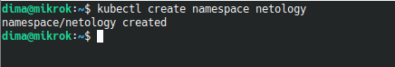

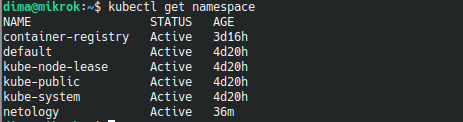

Пишем манифест Deployment , состоящего из двух контейнеров — nginx и multitool:

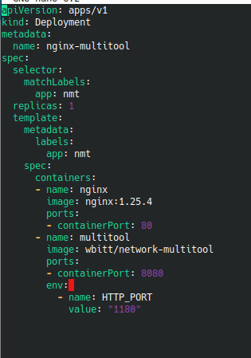

Запускаем:

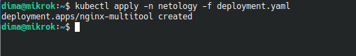

Проверяем:

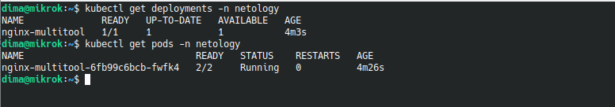

Увеличиваем количество реплик до двух:

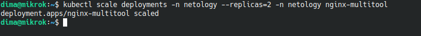

Результат:

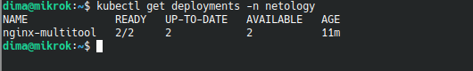

После масштабирования стало два пода: 

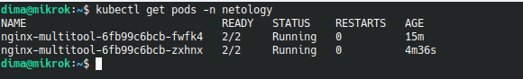

Пишем манифест Service с именем nginx-multitool-svc в namespace netology.

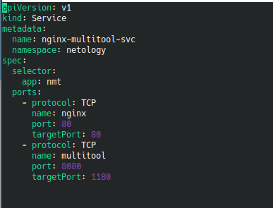

Запускаем:

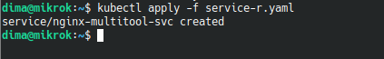

Проверем сервисы в namespace netology: 

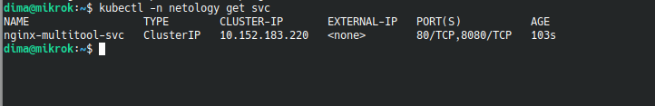

Пишем манифест отдельного пода multitool в namespace netology.

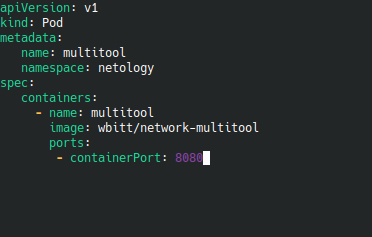

Применяем:

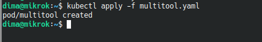

Проверяем поды в namespace netology: 

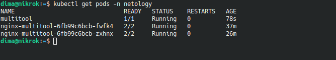

С помощью curl, проверяю, есть ли из пода multitool доступ до приложений:

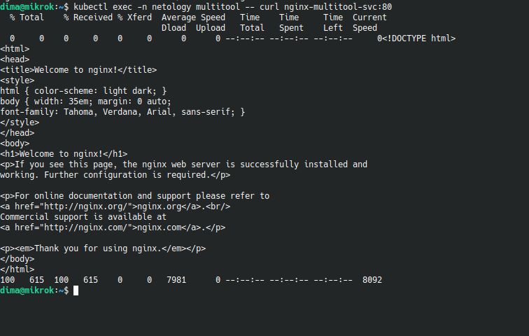

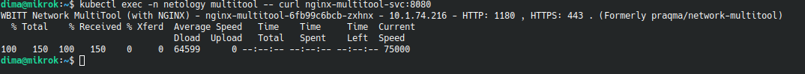

###Задание 2

*Создать Deployment приложения nginx и обеспечить старт контейнера только после того, как будет запущен сервис этого приложения.*

*Убедиться, что nginx не стартует. В качестве Init-контейнера взять busybox.*

*Создать и запустить Service. Убедиться, что Init запустился.*
*Продемонстрировать состояние пода до и после запуска сервиса.*

Создаем манифест Deployment приложения nginx, который запустится только после запуска сервиса. В качестве Init-контейнера
используем busybox:

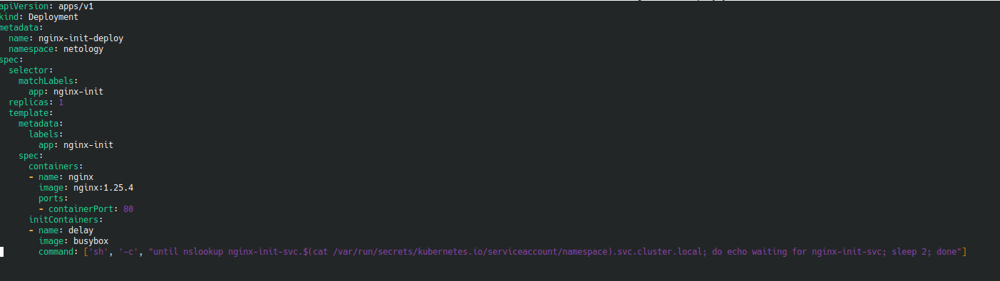

Применяем:

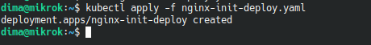

Проверяем запущен ли Pod: 

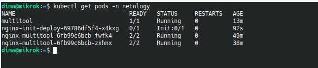

Pod не запущен и находится в состоянии Init:0/1.

Создаем манифест Service:

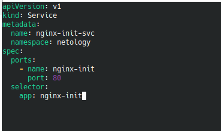

Применяем:

Проверяем запуск под nginx:

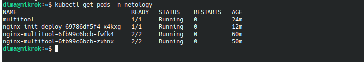

Ссылка на манифесты:

https://github.com/dmistus/Kubernetes_03/tree/main/src
 

